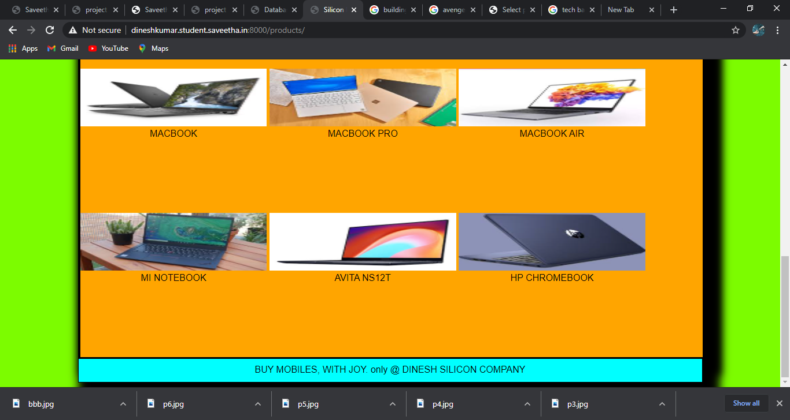
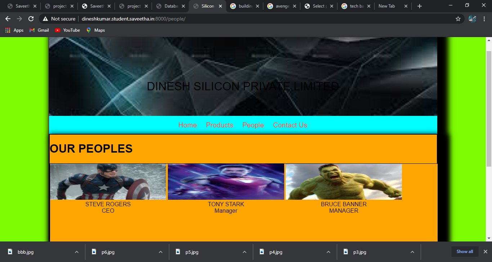
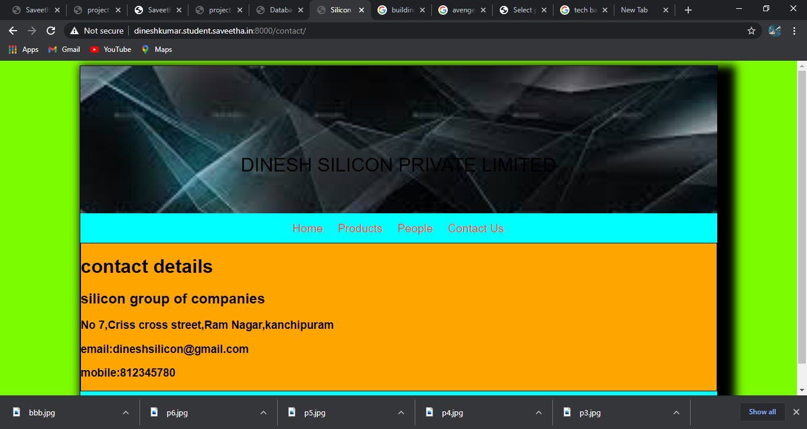
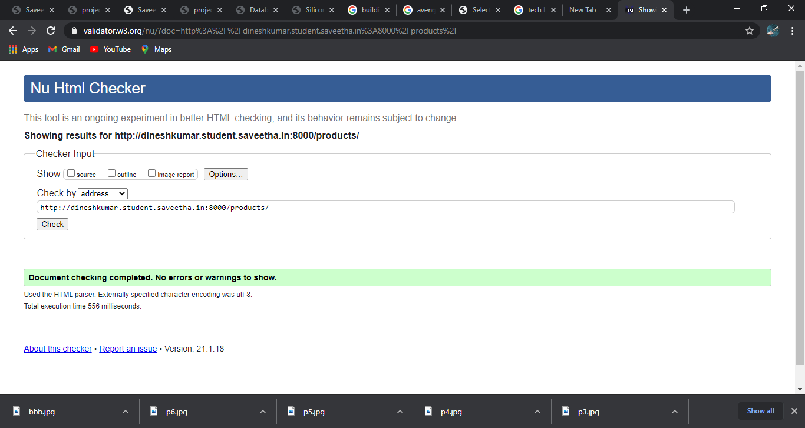
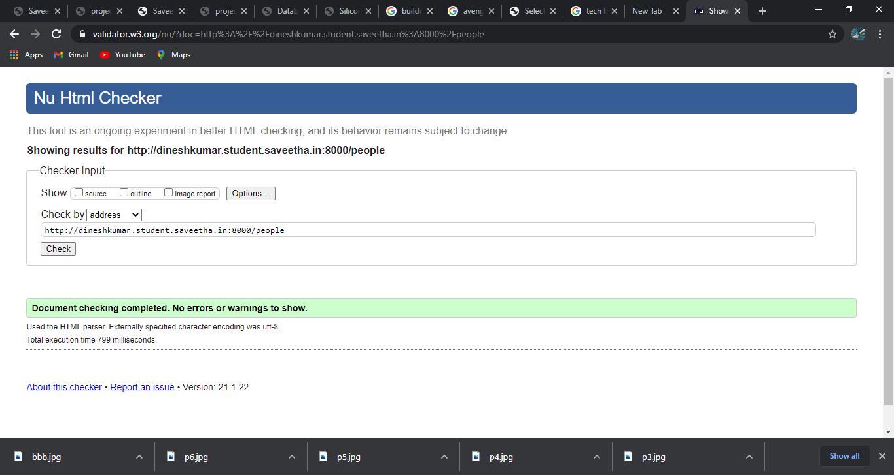

# Dynamic Website Design for a Manufacturing Company
## AIM:
To design a dynamic website for a chip manufacturing company.

## DESIGN STEPS:
### Step 1: 
Requirement collection.
### Step 2:
Creating the layout using HTML and CSS.
### Step 3:
Updating the sample content.
### Step 4:
Choose the appropriate style and color scheme.
### Step 5:
Validate the layout in various browsers.
### Step 6:
Validate the HTML code.
### Step 7:
Create a database model and migrate the database.
### Step 8:
Retrieve data from database and display it in a dynamic webpage.
### Step 9:
Publish the website in the given URL.

## PROGRAM:
### base.hml
```

<!DOCTYPE html>
<html lang="en">

<head>
    <title>Silicon Private Limited</title>
    <link rel="stylesheet" href="">
    <link rel = "icon" href ="" type = "image/x-icon"> 
              
</head>

<body>
    <div class="container">
    <div class="banner">
        BALA MOBILES.
    </div>
    <div class="menu">
        <div class="menuitem"><a href="/home">Home</a></div> 
        <div class="menuitem"><a href="/products">Products</a></div> 
        <div class="menuitem"><a href="/people">People</a></div>
        <div class="menuitem"><a href="/contact">Contact Us</a></div> 
    </div><div class="content">
        
    
    </div>
    <div class="footer">
        BUY MOBILES,
        WITH JOY.
        only @ DINESH SILICON COMPANY
    </div>
    </div>
</body>
</html>

```

### people.html

```


<!DOCTYPE html>
<html>

<head>
    <title>PEOPLE LIST</title>
    <link rel="stylesheet" href="">
</head>

<body>
    
    <div class="container">
        <h1>OUR PEOPLES</h1>
        <div class="content">
            <div class="peoplelist">
                
                <div class="people">
                    <div class="peoplelist">
                        
                    </div>
                    <div class="peoplephoto">{{ photo }}</div>
                    <div class="peoplename">{{ people.name }}</div>
                    <div class="peopledesignation">{{ people.designation }}</div>
                </div>
                
            </div>
       </div>
    
    </div>
</body>

</html>

```
### product.html
```


<!DOCTYPE html>
<html>

<head>
    <title>PRODUCTS LIST</title>
    <link rel="stylesheet" href="">
</head>

<body>
    
    <div class="container">
        <h1>OUR PREMIUM PRODUCTS</h1>
        <div class="content">
            <div class="peoplelist">
                
                <div class="people">
                    <div class="peoplelist">
                        
                    </div>
                    <div class="peoplephoto">{{ photo }}</div>
                    <div class="peoplename">{{ product.name }}</div>
                    <div class="peopledesignation">{{ product.price }}</div>
                </div>
                
            </div>
        </div>
    </div>
    
</body>

</html>

```


## OUTPUT:
[output](./static/img/i6.png)












## RESULT:
Thus a website is designed for the chip manufacturing company and is hosted in the url http://dineshkumar.student.saveetha.in:8000/.


## RESULT: